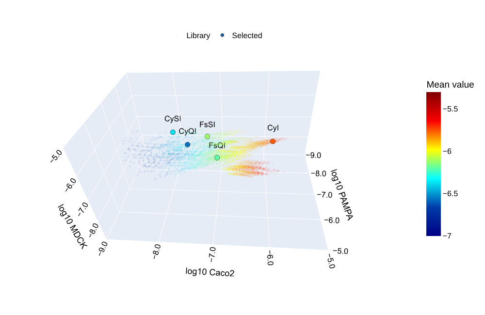

# Deep Learning–assisted Design of Low Mammalian Cytotoxic Cyanine Photosensitizers


This repository provides data and code supporting the study:
"Integrating Deep Learning-assisted Design with Empirical Engineering for Precise and Practical Photodynamic Antibacterial Therapy".




## Contents
This repository integrates SQL scripts, curated datasets, and analysis to support prediction of mammalian cellular permeability.
- **Data Processing**
  - SQL scripts for PAMPA, Caco-2, MDCK essays data extraction located in `sql` directory.
  - Preprocessing scripts for data standardization in `prepare_papp.py`.
  - Data splitting in `split_input.py` for creating training, validation, and test sets.

- **Deep Learning Pipeline**
  - Chemprop multi-task model training in `train_model.py`.
  - Model evaluation in `evaluate_model.py` and training results in `training_results` directory.
  - Molecule prediction: `predict.py` and prediction results in `cyanine_library_predictions.csv` .

- **Visualization**
    - Reports summarizing model performance in `training_report.html`.
    - Prediction visualization of CyQI, CySI, FsQI, FsSI, and CyI in `visualize_prediction.ipynb` and `permeability_3D.svg`.
    - Model training results and metrics curves in `training_results` directory.


## Citation

- **Chemprop GitHub Repository**: [Chemprop GitHub](https://github.com/chemprop/chemprop)

```bibtex
@article{doi:10.1021/acs.jcim.3c01250,
author = {Heid, Esther and Greenman, Kevin P. and Chung, Yunsie and Li, Shih-Cheng and Graff, David E. and Vermeire, Florence H. and Wu, Haoyang and Green, William H. and McGill, Charles J.},
title = {Chemprop: A Machine Learning Package for Chemical Property Prediction},
journal = {Journal of Chemical Information and Modeling},
volume = {64},
number = {1},
pages = {9-17},
year = {2024},
doi = {10.1021/acs.jcim.3c01250},
    note ={PMID: 38147829},

URL = {https://doi.org/10.1021/acs.jcim.3c01250},
eprint = {https://doi.org/10.1021/acs.jcim.3c01250}
}
```


